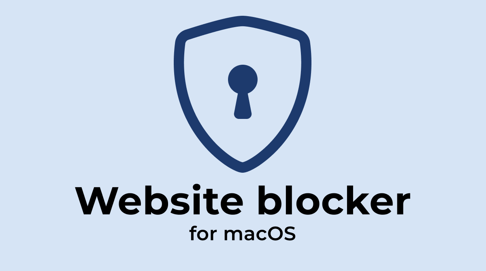

# Website Blocker

A simple set of bash scripts to block distracting websites on macOS.

## Features

- Block websites permanently
- Schedule website blocking during specific hours & days
- Support for both with and without 'www' subdomain

## How It Works

The blocking mechanism works by redirecting website domains to your local machine (127.0.0.1) through the `/etc/hosts` file. When you try to access a blocked website, your computer redirects the request to itself instead of the actual website server.

## Part 1: Blocking Websites Permanently

You can block websites by editing the hosts file manually:

1. Open Terminal and edit the hosts file:

```bash
sudo nano /etc/hosts
```

2. Add the websites you want to block by adding these lines:

```bash
127.0.0.1   facebook.com
127.0.0.1   www.facebook.com
127.0.0.1   youtube.com
127.0.0.1   www.youtube.com
```

3. Save the file:

   - Press `Control + O` to save
   - Press `Enter` to confirm
   - Press `Control + X` to exit

4. Flush the DNS cache:

```bash
sudo dscacheutil -flushcache; sudo killall -HUP mDNSResponder
```

## Part 2: Scheduled Website Blocking

For blocking websites during specific hours, you can create and use blocking scripts. Here's how to set it up:

1. Create two scripts:

First, create `block-sites.sh` ([source](https://github.com/janjezek/website-blocking/blob/main/block-sites.sh)):

```bash
nano ~/block-sites.sh
```

Add this content:

```bash
#!/bin/bash
BLOCKED_SITES=(
    "127.0.0.1   facebook.com"
    "127.0.0.1   www.facebook.com"
    "127.0.0.1   youtube.com"
    "127.0.0.1   www.youtube.com"
)

# Backup the current /etc/hosts file
sudo cp /etc/hosts /etc/hosts.bak

# Add blocked sites if not already present
for SITE in "${BLOCKED_SITES[@]}"; do
    if ! grep -q "$SITE" /etc/hosts; then
        echo "$SITE" | sudo tee -a /etc/hosts > /dev/null
    fi
done

# Flush DNS cache
sudo dscacheutil -flushcache
sudo killall -HUP mDNSResponder
```

Then create `unblock-sites.sh` ([source](https://github.com/janjezek/website-blocking/blob/main/unblock-sites.sh)):

```bash
nano ~/unblock-sites.sh
```

Add this content:

```bash
#!/bin/bash

# Check if backup exists and restore it
if [ -f /etc/hosts.bak ]; then
    sudo cp /etc/hosts.bak /etc/hosts
    sudo dscacheutil -flushcache
    sudo killall -HUP mDNSResponder
fi
```

2. Make the scripts executable:

```bash
chmod +x ~/block-sites.sh ~/unblock-sites.sh
```

3. Set up scheduled blocking using crontab:

```bash
export EDITOR=nano
crontab -e
```

4. Add the scheduling rules. Here are some examples:

```bash
# Block from 9 AM to 5 PM on weekdays
0 9 * * 1-5 ~/block-sites.sh
0 17 * * 1-5 ~/unblock-sites.sh

# Block from 10 AM to 6 PM every day
0 10 * * * ~/block-sites.sh
0 18 * * * ~/unblock-sites.sh

# Block during lunch hour (12 PM to 1 PM)
0 12 * * * ~/block-sites.sh
0 13 * * * ~/unblock-sites.sh
```

Note:

- Crontab format is: `minute hour day month weekday command`
- Weekdays are: 1=Monday through 7=Sunday

You can run these scripts manually at any time:

```bash
bash ~/block-sites.sh    # To block websites
bash ~/unblock-sites.sh  # To unblock websites
```

## Troubleshooting

If websites are still accessible after blocking:

1. Clear your browser cache
2. Restart your browser
3. Verify hosts file content:

```bash
cat /etc/hosts
```

4. Refresh DNS cache:

```bash
sudo dscacheutil -flushcache; sudo killall -HUP mDNSResponder
```
